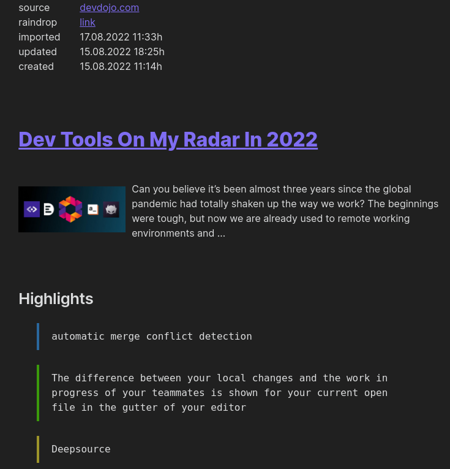

# Obsidian raindrop.io Integration Plugin
This plugin aims to integrate bookmarks/highlights/tags from _raindrop.io_ (https://raindrop.io) with _Obsidian_ (https://obsidian.md).

## PKM Flow
In order to do so it fully supports the following PKM workflow:
- start by adding a bookmark within *raindrop.io*
- enhance the bookmark by adding highlights, notes and tags using *raindrop.io*
- move the enriched bookmark into the configured _raindrop.io_ input directory (default: `obsidian`)
- import bookmarks into _Obsidian_ using this plugin (periodically, or on demand). By default, these bookmarks along with their respective highlights and notes are now available in _Obsidian_ under `articles/YYYY/MM/DD`
- bookmarks are now moved into the configured _raindrop.io_ destination directory (default: `raindrop`)

**Note:** Please be aware that potentially pre-existing notes are overwritten if a bookmark is (accidentally or intentionally) imported more than once. It's probably best to avoid editing generated notes directly.

## Setup
### Create *raindrop.io* Token
For this extension to work you need a raindrop.io access token, for this you need to create an app in *raindrop.io*'s setting:
- in the *For Developers* section (https://app.raindrop.io/settings/integrations) click on + Create new app.
- set the app name, accept the Terms and Guidelines and click _Create_.
- click the newly created app
- in the bottom of the form click on *Create test token*.
- copy the created token.

### Install Plugin
- install and enable this plugin in Obsidian
- generate *raindrop.io* auth token (as described above)
- paste previously created *raindrop.io* auth token in **Plugin-Settings** field *raindrop.io auth token*
- change other plugin settings as required

#### Manual Installation
Go to the releases and download the latest *main.js*, *manifest.json* and *styles.css* files. Create a folder called `obsidian-raindrop-highlights` inside `.obsidian/plugins` and place the files in it.

#### Compatibility
This plugin has been tested on both Windows and Linux. If you find any issue on other platforms, please get in touch.

### Commands
- *Sync highlights*: use this command to import bookmarks from *raindrop.io* on demand
